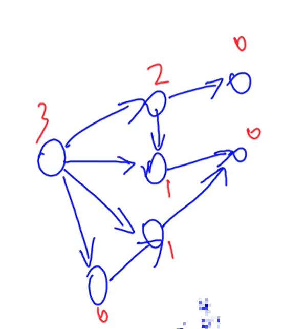
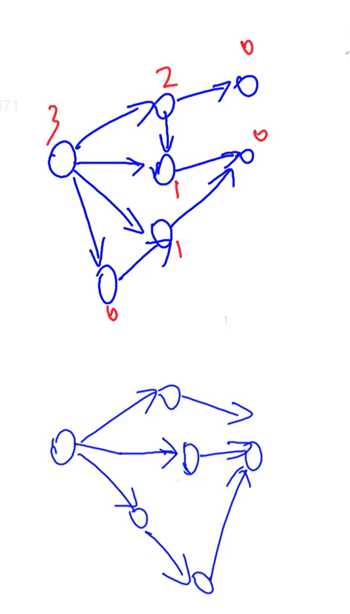
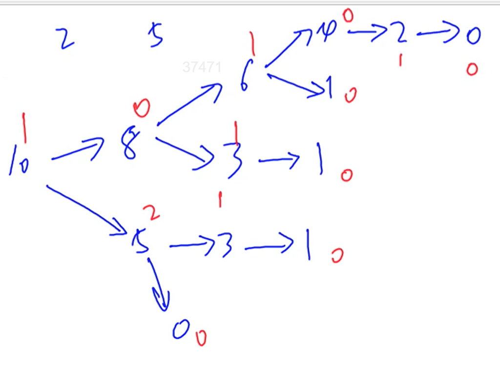

# 公平组合游戏ICG

若一个游戏满足

1. 由两名玩家交替行动
2. 在游戏进程的任意时刻，可以执行的合法行动与轮到哪名玩家无关(游戏的局势不能区分玩家的身份，例如黑白棋就是不行的)
3. 不能行动的玩家判负

## 两种状态

先手必败状态:不管怎么操作，剩下的状态都是先手必胜状态

先手必胜状态 :存在一种操作可以将状态转成先手必败状态

# Nim游戏

$$
给定n堆石子，两位玩家轮流操作，每次操作可以从任意一堆石子中拿走任意数量的石子
$$

$$
（可以拿完，但不能不拿）最后无法进行操作的人视为失败
$$

$$
问如果两人都采用最优策略，先手是否必胜。
$$
## 结论

$$
若a_1\bigoplus a_2\bigoplus\dots a_n = 0先手必败\tag x
$$

$$
若a_1\bigoplus a_2\bigoplus\dots a_n \neq 0先手必胜
$$

$$
需证明：当a_1\bigoplus a_2\bigoplus\dots a_n \neq 0时，我们可以进行某一操作使得剩下的数异或值为0\tag1
$$

$$
当a_1\bigoplus a_2\bigoplus\dots a_n = 0时，我们无论进行什么操作都无法达到剩余数异或值不等于0\tag2
$$

$$
\tag1证明：令x=a_1\bigoplus a_2\bigoplus\dots a_n
$$

$$
设x二进制表示中最高位的1在第k位,说明[a_1,a_n]中必然有一个数a_i的二进制表示第k位是1
$$

$$
易得出：a_i\bigoplus x<a_i
$$

$$
所以我们可以从a_i这堆中拿走a_i-(a_i\bigoplus x)个，这时a_i个数变为a_i\bigoplus x个
$$

$$
所以拿完之后原式变成了：a_1\bigoplus a_2\bigoplus\dots\bigoplus (a_i\bigoplus x)\dots \bigoplus a_n
$$

$$
=x\bigoplus x=0即变成了先手必败态
$$

$$
对于(2)我们用反证法进行证明，假设存在一个操作可以使得剩余数异或值不为0
$$

$$
设这个操作是将a_i堆中取出x个，此时a_i变为a_i-x
$$

$$
原式变成：a_1\bigoplus a_2\bigoplus\dots\bigoplus (a_i-x)\dots \bigoplus a_n=0\tag y
$$

$$
将(x),(y)相异或得到a_i\bigoplus (a_i-x) = 0,即a_i=a_i-x，相当于没拿
$$

$$
与假设矛盾，故不存在这样一个操作
$$


# SG函数

$$
定义mex函数找到一个集合S中不存在的最小的自然数
$$

$$
定义每一种状态x则定义x是终点状态时：SG(x)=0
$$

$$
x不是终点状态时:设x可以转化成的状态为y_1,y_2,\dots,y_k
$$

$$
则SG(x)=mex(SG(y_1),SG(y_2),\dots,SG(y_k))
$$

$$
对于只有一个图的示例如下：
$$


$$
通过SG函数可知:SG(x)=0则为必败态，SG(x)\neq0为必胜态
$$

$$
证明：SG(x) = 0，说明x转移到的所有状态y都不存在SG(y)=0，即不能使对手处于必败态
$$

$$
SG(x)\neq0，说明存在一种状态y使得SG(y)=0,即可以使得对手处于必败态
$$

$$
对于很多个图，即玩家可以选择任意一个图走一步，即进行一次转换：
$$


$$
若有k个图每个图的起点状态为SG(x_i)则有
$$

$$
SG(x_1)\bigoplus SG(x_2)\bigoplus\dots\bigoplus SG(x_k)=0为必败态
$$

$$
SG(x_1)\bigoplus SG(x_2)\bigoplus\dots\bigoplus SG(x_k)\neq0为必胜态
$$

$$
证明：同Nim游戏的证明
$$


## AcWing 891. Nim游戏   [原题链接](https://www.acwing.com/problem/content/893/)

给定nn堆石子，两位玩家轮流操作，每次操作可以从任意一堆石子中拿走任意数量的石子（可以拿完，但不能不拿），最后无法进行操作的人视为失败。

问如果两人都采用最优策略，先手是否必胜。

#### 输入格式

第一行包含整数nn。

第二行包含nn个数字，其中第 ii 个数字表示第 ii 堆石子的数量。

#### 输出格式

如果先手方必胜，则输出“Yes”。

否则，输出“No”。

#### 数据范围

1≤n≤1051≤n≤105,
1≤每堆石子数≤1091≤每堆石子数≤109

#### 输入样例：

```
2
2 3
```

#### 输出样例：

```
Yes
```

```java
    public static void main(String[] args) {
        int n = in.nextInt();
        int res = 0;
        while (n-- > 0) {
            res ^= in.nextInt();
        }
        if (res == 0) {
            out.println("No");
        }else {
            out.println("Yes");
        }
        out.flush();
        out.close();
    }
```

## AcWing 892. 台阶-Nim游戏   [原题链接](https://www.acwing.com/problem/content/894/)

现在，有一个nn级台阶的楼梯，每级台阶上都有若干个石子，其中第ii级台阶上有aiai个石子(i≥1i≥1)。

两位玩家轮流操作，每次操作可以从任意一级台阶上拿若干个石子放到下一级台阶中（不能不拿）。

已经拿到地面上的石子不能再拿，最后无法进行操作的人视为失败。

问如果两人都采用最优策略，先手是否必胜。

#### 输入格式

第一行包含整数nn。

第二行包含nn个整数，其中第ii个整数表示第ii级台阶上的石子数aiai。

#### 输出格式

如果先手方必胜，则输出“Yes”。

否则，输出“No”。

#### 数据范围

1≤n≤1051≤n≤105,
1≤ai≤1091≤ai≤109

#### 输入样例：

```
3
2 1 3
```

#### 输出样例：

```
Yes
```

## 算法思路

$$
若a_1\bigoplus a_3\bigoplus\dots \bigoplus a_i = 0(i是奇数)先手必败
$$

$$
若a_1\bigoplus a_3\bigoplus\dots\bigoplus a_i \neq 0(i是奇数)先手必胜
$$

$$
证明：如果对手拿的是偶数台阶上的石子
$$

$$
我们只要把这些石子再向下拿就行，这样保证奇数台阶上的石子数量不变
$$

$$
如果对手拿的是奇数台阶上的石子，证明同Nim游戏
$$

```java
    public static void main(String[] args) {
        int n = in.nextInt();
        int res = 0;
        for (int i = 1; i <= n; i++) {
            int x = in.nextInt();
            if ((i & 1) == 1) {
                res ^= x;
            }
        }
        if (res != 0) {
            out.println("Yes");
        }else {
            out.println("No");
        }
        out.flush();
        out.close();
    }
```


## AcWing 893. 集合-Nim游戏   [原题链接](https://www.acwing.com/problem/content/895/)

给定nn堆石子以及一个由kk个不同正整数构成的数字集合SS。

现在有两位玩家轮流操作，每次操作可以从任意一堆石子中拿取石子，每次拿取的石子数量必须包含于集合SS，最后无法进行操作的人视为失败。

问如果两人都采用最优策略，先手是否必胜。

#### 输入格式

第一行包含整数kk，表示数字集合SS中数字的个数。

第二行包含kk个整数，其中第ii个整数表示数字集合SS中的第ii个数sisi。

第三行包含整数nn。

第四行包含nn个整数，其中第ii个整数表示第ii堆石子的数量hihi。

#### 输出格式

如果先手方必胜，则输出“Yes”。

否则，输出“No”。

#### 数据范围

1≤n,k≤1001≤n,k≤100,
1≤si,hi≤100001≤si,hi≤10000

#### 输入样例：

```
2
2 5
3
2 4 7
```

#### 输出样例：

```
Yes
```

## 算法思路

假设某堆石子的个数为10，可以求出它的初始状态`SG(10)=1`如图：



有`n`堆石子就能求出`n`个`SG`的初始值，将这些数进行异或即可得到整个问题的SG初始值

```java
    private static class SG {
        //可以取的个数的集合
        private int[] collection;
        //sg函数的值
        private int[] sg;
        //石子个数集合
        private int[] stoneNumber;
        private final int N;

        public SG(int N, int[] collection, int[] stoneNumber) {
            this.collection = collection;
            this.stoneNumber = stoneNumber;
            this.N = N;
            this.sg = new int[N];
            Arrays.fill(sg, -1);
        }

        public int getXor() {
            int res = 0;
            for (int x : stoneNumber) {
                res ^= sgFunction(x);
            }
            return res;
        }

        //记忆化搜索过程
        private int sgFunction(int x) {
            //状态已经被算过
            if (sg[x] != -1) {
                return sg[x];
            }
            //存储当前状态所有可以到达的状态
            Set<Integer> set = new HashSet<>();
            for (int out : collection) {
                if (x >= out) {
                    set.add(sgFunction(x - out));
                }
            }
            //求出当前集合不存在的最小自然数
            for (int i = 0; ; i++) {
                if (!set.contains(i)) {
                    sg[x] = i;
                    return i;
                }
            }
        }
    }

    public static void main(String[] args) {
        int n = in.nextInt();
        int[] collection = new int[n];
        for (int i = 0; i < n; i++) {
            collection[i] = in.nextInt();
        }
        int m = in.nextInt();
        int[] tones = new int[m];
        for (int i = 0; i < m; i++) {
            tones[i] = in.nextInt();
        }
        int max = -1;
        for (int x : tones) {
            max = Math.max(max, x);
        }
        SG sg = new SG(max + 1, collection, tones);
        int res = sg.getXor();
        if (res != 0) {
            out.println("Yes");
        }else {
            out.println("No");
        }
        out.flush();
        out.close();
    }

```

## AcWing 894. 拆分-Nim游戏   [原题链接](https://www.acwing.com/problem/content/896/)

给定nn堆石子，两位玩家轮流操作，每次操作可以取走其中的一堆石子，然后放入两堆**规模更小**的石子（新堆规模可以为0，且两个新堆的石子总数可以大于取走的那堆石子数），最后无法进行操作的人视为失败。

问如果两人都采用最优策略，先手是否必胜。

#### 输入格式

第一行包含整数nn。

第二行包含nn个整数，其中第ii个整数表示第ii堆石子的数量aiai。

#### 输出格式

如果先手方必胜，则输出“Yes”。

否则，输出“No”。

#### 数据范围

1≤n,ai≤1001≤n,ai≤100

#### 输入样例：

```
2
2 3
```

#### 输出样例：

```
Yes
```

## 算法思路

$$
在上述SG函数的基础上，我们把任意一个状态x可以转成的状态设为(y_i,y_j)即分成两堆
$$

$$
易知：SG(y_i,y_j)=SG(y_i)\bigoplus SG(y_j)\tag1
$$

$$
SG(x)=mex(SG(y_1,y_2),SG(y_3,y_4),\dots,SG(y_i,y_j))\tag2
$$

$$
(1),(2)两式相结合就能求出SG(x)
$$

```java
    private static class SG {
        //sg函数的值
        private int[] sg;
        //石子个数集合
        private int[] stoneNumber;
        private final int N;

        public SG(int N, int[] stoneNumber) {
            this.stoneNumber = stoneNumber;
            this.N = N;
            this.sg = new int[N];
            Arrays.fill(sg, -1);
        }

        public int getXor() {
            int res = 0;
            for (int x : stoneNumber) {
                res ^= sgFunction(x);
            }
            return res;
        }

        //记忆化搜索过程
        private int sgFunction(int x) {
            //状态已经被算过
            if (sg[x] != -1) {
                return sg[x];
            }
            //存储当前状态所有可以到达的状态
            Set<Integer> set = new HashSet<>();
            for (int i = 0; i < x; i++) {
                for (int j = 0; j <= i; j++) {
                    set.add(sgFunction(i) ^ sgFunction(j));
                }
            }
            int number = mex(set);
            sg[x] = number;
            return number;
        }

        //mex函数
        //求出当前集合不存在的最小自然数
        private int mex(Set<Integer> set) {
            for (int i = 0; ; i++) {
                if (!set.contains(i)) {
                    return i;
                }
            }
        }
    }

    public static void main(String[] args) {
        int n = in.nextInt();
        int[] stones = new int[n];
        in.nextIntegerArray(stones);
        int max = -1;
        for (int x : stones) max = Math.max(max, x);
        SG sg = new SG(max + 1, stones);
        int res = sg.getXor();
        if (res != 0) {
            out.println("Yes");
        }else {
            out.println("No");
        }
        out.flush();
        out.close();
    }

```

