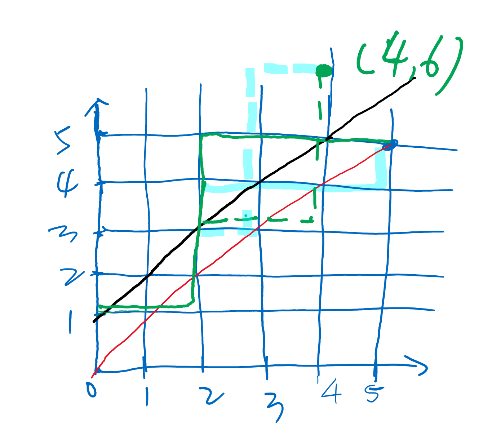

# 组合数

$$
\complement{^b_a} = \frac{(a-b+1)\times(a-b+2)\times\dots \times(a-1)\times a}{1\times 2\times\dots\times b}=\frac{a!}{b!\times (a-b)!}
$$

$$
递推式:\complement{^b_a}=\complement{^{a-b}_a}=\complement{^b_{a-1}}+\complement{^{b-1}_{a-1}}
$$

$$
递推式证明：
$$

$$
我们假设a个元素中有一个特殊元素x
$$

$$
我们将所有的组合数分成两类：
$$

$$
包含x的一类，有\complement{^{b-1}_{a-1}}种
$$

$$
不包含x的一类，有\complement{^{b}_{a-1}}种
$$

$$
两个相加就是全部的组合数即\complement{^{b}_{a}}
$$

# 根据数据量选择合适的方式

1. `100000组询问，1<=b<=a<=2000`:递推
   $$
   时间复杂度O(n^2)
   $$
   
2. `100000组询问，1<=b<=a<=1e5`:预处理
   $$
   利用\complement{^b_a} = \frac{a!}{b!\times (a-b)!}
   $$

   $$
   预处理出fact[i]=i! \mod m和infact[i]={i!}^{-1}\mod m
   $$

   $$
   infact[i]=infact[i - 1]\times i的逆元，前面资料中的乘法逆元中可知i^{-1}\equiv i^{m-2}(mod m),利用快速幂能求
   $$

   $$
   注意，上述条件是m为质数，这样才能有费马小定理，否则要用扩展欧几里得算法求逆元
   $$
   
   
   $$
   那么\complement{^b_a} = fact[a] \times infact[b - a] \times infact[b]
   $$
   
   
   $$
   时间复杂度O(n\log{n})
   $$
   
3. `20组询问`,`1<=b<=a<=1e18`:卢卡斯定理Lucas
   $$
   Lucas定理是用来求 c(n,m) mod p，p为素数的值
   $$

$$
\complement{^b_a} \equiv \complement{^{b\ modp}_{a\ modp}}\times\complement{^{b/p}_{a/p}}(\mod p)
$$

$$
时间复杂度O(\log{^n_p} p \log p)
$$

4. 一组询问，`1<=b<=a<=5000`但是结果可能很大：高精度计算

$$
利用\complement{^b_a} = \frac{(a-b+1)\times(a-b+2)\times\dots \times(a-1)\times a}{1\times 2\times\dots\times b}
$$

$$
实现高精度乘法和除法，但是这样比较难写
$$

$$
我们可以先把\complement{^b_a}分解质因数为p_1^{a_1}p_2^{a_2}\dots p_k^{a_k},只考虑高精度乘法
$$

$$
利用\complement{^b_a} =\frac{a!}{b!\times (a-b)!}
$$

$$
我们分别得出分子和分母某个质因数p_i的个数n,m，m-n就是\complement{^b_a}中质因子p_i的个数
$$

$$
a!中某个质因子p_i的个数m=\lfloor\frac{a}{p_i}\rfloor+\lfloor\frac{a}{p_i^2}\rfloor+\dots
$$

$$
\lfloor\frac{a}{p_i}\rfloor代表a!中包含一个p_i的质因子的个数,\lfloor\frac{a}{p_i^2}\rfloor表示a!中包含两个p_i即p_i^2的质因子的个数
$$

$$
以此类推，相加就是a!中包含质因子p_i的个数
$$

# 卡特兰数

$$
给定n个0和n个1，它们将按照某种顺序排成长度为2n的序列，求它们能排列成的所有序列中
$$

$$
能够满足任意前缀序列中0的个数都不少于1的个数的序列有多少个
$$

$$
我们可以把这个问题转换成路径问题即从(0,0)出发，选择0向右走1格，选择1向上走1格
$$

$$
即从(0,0)到(n, n)的路径数,总数为\complement{{^{n}_{2n}}}
$$


$$
如上图，红色线上的点代表此刻0的个数=1的个数,我们不能经过红色线之上的点即不经过黑色线上的点
$$

$$
我们可以将任意一条经过黑色线上的点，对于第一次与黑线的交点之后的部分关于黑线做轴对称
$$

$$
会发现，最后一定都会到如图的点(4,6)，即点(n-1, n+1)
$$

$$
所以所有经过黑线的路径方案数是\complement{{^{n-1}_{2n}}}
$$

$$
可知所有满足要求的方案数为:\complement{{^{n}_{2n}}}-\complement{{^{n-1}_{2n}}}=\frac{\complement{{^{n}_{2n}}}}{n+1}
$$

## AcWing 885. 求组合数 I   [原题链接](https://www.acwing.com/problem/content/887/)

给定nn组询问，每组询问给定两个整数a，ba，b，请你输出Cba mod (109+7)Cab mod (109+7)的值。

#### 输入格式

第一行包含整数nn。

接下来nn行，每行包含一组aa和bb。

#### 输出格式

共nn行，每行输出一个询问的解。

#### 数据范围

1≤n≤100001≤n≤10000,
1≤b≤a≤20001≤b≤a≤2000

#### 输入样例：

```
3
3 1
5 3
2 2
```

#### 输出样例：

```
3
10
1
```

```java
    private static class Combination{
        private int[][] c;
        private final int n;

        public Combination(int n) {
            this.n = n;
            init();
        }
        private void init(){
            c = new int[n + 1][n + 1];
            for (int i = 0; i <= n; i++) {
                for (int j = 0; j <= i; j++) {
                    int MOD = (int) (1e9 + 7);
                    if (j == 0) c[i][j] = 1;
                    else c[i][j] = (c[i - 1][j] + c[i - 1][j - 1]) % MOD;
                }
            }
        }
        public int com(int a, int b) {
            return c[a][b];
        }
    }

```

## AcWing 886. 求组合数 II   [原题链接](https://www.acwing.com/problem/content/888/)

给定nn组询问，每组询问给定两个整数a，ba，b，请你输出Cba mod (109+7)Cab mod (109+7)的值。

#### 输入格式

第一行包含整数nn。

接下来nn行，每行包含一组aa和bb。

#### 输出格式

共nn行，每行输出一个询问的解。

#### 数据范围

1≤n≤100001≤n≤10000,
1≤b≤a≤1051≤b≤a≤105

#### 输入样例：

```
3
3 1
5 3
2 2
```

#### 输出样例：

```
3
10
1
```

```java
    private static class Combination {
        private long[] fact;
        private long[] inFact;
        private final int n;
        private final int MOD = (int) (1e9 + 7);
        private int fastPower(long a, long b, long q) {
            long res = 1L;
            while (b > 0) {
                if ((b & 1) == 1) {
                    res = res * a % q;
                }
                b >>= 1;
                a = a * a % q;
            }
            return (int) res;
        }

        public Combination(int n) {
            this.n = n;
            init();
        }
        private void init() {
            fact = new long[n];
            inFact = new long[n];
            fact[0] = inFact[0] = 1;
            for (int i = 1; i < n; i++) {
                fact[i] = fact[i - 1] * i % MOD;
                inFact[i] = inFact[i - 1] * fastPower(i, MOD - 2, MOD) % MOD;
            }
        }
        public int com(int a, int b) {
            return (int)(fact[a] * inFact[b] % MOD * inFact[a - b] % MOD);
        }
    }
```

## AcWing 887. 求组合数 III   [原题链接](https://www.acwing.com/problem/content/889/)

给定nn组询问，每组询问给定三个整数a,b,pa,b,p，其中pp是质数，请你输出Cba mod pCab mod p的值。

#### 输入格式

第一行包含整数nn。

接下来nn行，每行包含一组a,b,pa,b,p。

#### 输出格式

共nn行，每行输出一个询问的解。

#### 数据范围

1≤n≤201≤n≤20,
1≤b≤a≤10181≤b≤a≤1018,
1≤p≤1051≤p≤105,

#### 输入样例：

```
3
5 3 7
3 1 5
6 4 13
```

#### 输出样例：

```
3
3
2
```

```java
    private static class Combination {
        private int mod;

        public void setMod(int mod) {
            this.mod = mod;
        }
        public Combination() {

        }
        private int fastPower(long a, long b, long q) {
            long res = 1L;
            while (b > 0) {
                if ((b & 1) == 1) {
                    res = res * a % q;
                }
                b >>= 1;
                a = a * a % q;
            }
            return (int) res;
        }
        private long com(int a, int b) {
            long res = 1L;
            for (int i = 1, j = a; i <= b; i++, j--) {
                res = res * j % mod;
                res = res * fastPower(i, mod - 2, mod) % mod;
            }
            return (int) res;
        }
        public int lucas(long a, long b) {
            if (a < mod && b < mod) {
                return (int) com((int)a, (int)b);
            }
            return (int) (com((int)(a % mod), (int)(b % mod)) * lucas(a / mod, b / mod) % mod);
        }
    }
```

## AcWing 888. 求组合数 IV   [原题链接](https://www.acwing.com/problem/content/890/)

输入a,ba,b，求CbaCab的值。

注意结果可能很大，需要使用高精度计算。

#### 输入格式

共一行，包含两个整数aa和bb。

#### 输出格式

共一行，输出CbaCab的值。

#### 数据范围

1≤b≤a≤50001≤b≤a≤5000

#### 输入样例：

```
5 3
```

#### 输出样例：

```
10
```

```java
    private static class Combination{
        private int[] primes;
        private int[] sum;
        private int count;
        private boolean[] st;

        private String com(int a, int b) {
            initPrimes(a);
            initSum(a, b);
            BigInteger res = new BigInteger("1");
            for (int i = 0; i < count; i++) {
                for (int j = 0; j < sum[i]; j++) {
                    res = res.multiply(BigInteger.valueOf(primes[i]));
                }
            }
            return res.toString();
        }
        private void initPrimes(int n){
            primes = new int[n + 1];
            st = new boolean[n + 1];
            for (int i = 2; i <= n; i++) {
                if (!st[i]) primes[count++] = i;
                for (int j = 0; primes[j] <= n / i; j++) {
                    st[primes[j] * i] = true;
                    if (i % primes[j] == 0) break;
                }
            }
        }
        private void initSum(int a, int b) {
            sum = new int[count];
            for (int i = 0; i < count; i++) {
                int p = primes[i];
                sum[i] = getNumber(a, p) - getNumber(b, p) - getNumber(a - b, p);
            }
        }
        //得到n中质因子p的个数
        private int getNumber(int n, int p) {
            int res = 0;
            while (n > 0) {
                res += n / p;
                n /= p;
            }
            return res;
        }
    }
```

## AcWing 889. 满足条件的01序列   [原题链接](https://www.acwing.com/problem/content/891/)

给定nn个00和nn个11，它们将按照某种顺序排成长度为2n2n的序列，求它们能排列成的所有序列中，能够满足任意前缀序列中00的个数都不少于11的个数的序列有多少个。

输出的答案对109+7109+7取模。

#### 输入格式

共一行，包含整数nn。

#### 输出格式

共一行，包含一个整数，表示答案。

#### 数据范围

1≤n≤1051≤n≤105

#### 输入样例：

```
3
```

#### 输出样例：

```
5
```

```java
    private static class Combination {
        private long[] fact;
        private long[] inFact;
        private final int n;
        private final int MOD = (int) (1e9 + 7);
        private int fastPower(long a, long b, long q) {
            long res = 1L;
            while (b > 0) {
                if ((b & 1) == 1) {
                    res = res * a % q;
                }
                b >>= 1;
                a = a * a % q;
            }
            return (int) res;
        }

        public Combination(int n) {
            this.n = n;
            init();
        }
        private void init() {
            fact = new long[n];
            inFact = new long[n];
            fact[0] = inFact[0] = 1;
            for (int i = 1; i < n; i++) {
                fact[i] = fact[i - 1] * i % MOD;
                inFact[i] = inFact[i - 1] * fastPower(i, MOD - 2, MOD) % MOD;
            }
        }
        public int com(int a, int b) {
            return (int)(fact[a] * inFact[b] % MOD * inFact[a - b] % MOD);
        }
    }

    public static void main(String[] args) {
        int n = in.nextInt();
        Combination c = new Combination(n << 1 + 5);
        // /(n+1) = *(n+1)^{-1}
        int res = (int) ((long)c.com(n << 1, n) * c.fastPower(n + 1, c.MOD - 2, c.MOD) % c.MOD);
        out.println(res);
        out.flush();
        out.close();
    }
```

