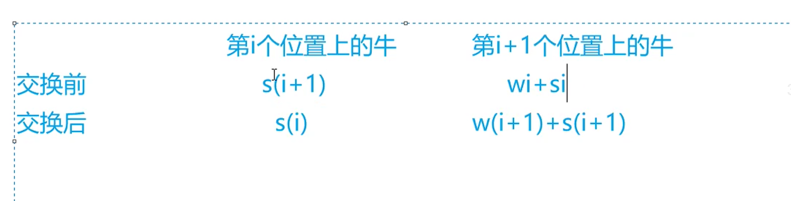

## AcWing 125. 耍杂技的牛   [原题链接](https://www.acwing.com/problem/content/127/)

农民约翰的N头奶牛（编号为1..N）计划逃跑并加入马戏团，为此它们决定练习表演杂技。

奶牛们不是非常有创意，只提出了一个杂技表演：

叠罗汉，表演时，奶牛们站在彼此的身上，形成一个高高的垂直堆叠。

奶牛们正在试图找到自己在这个堆叠中应该所处的位置顺序。

这N头奶牛中的每一头都有着自己的重量WiWi以及自己的强壮程度SiSi。

一头牛支撑不住的可能性取决于它头上所有牛的总重量（不包括它自己）减去它的身体强壮程度的值，现在称该数值为风险值，风险值越大，这只牛撑不住的可能性越高。

您的任务是确定奶牛的排序，使得所有奶牛的风险值中的最大值尽可能的小。

#### 输入格式

第一行输入整数N，表示奶牛数量。

接下来N行，每行输入两个整数，表示牛的重量和强壮程度，第i行表示第i头牛的重量WiWi以及它的强壮程度SiSi。

#### 输出格式

输出一个整数，表示最大风险值的最小可能值。

#### 数据范围

1≤N≤500001≤N≤50000,
1≤Wi≤10,0001≤Wi≤10,000,
1≤Si≤1,000,000,0001≤Si≤1,000,000,000

#### 输入样例：

```
3
10 3
2 5
3 3
```

#### 输出样例：

```
2
```

# 算法思路

$$
按照w_i+s_i从小到大的顺序排，最大的危险系数是最小的
$$

$$
证明：易得贪心得到的答案 >= 最优解，只需证明贪心得到的答案 <= 最优解
$$

$$
假设最优解不是按照这种方式排序，就一定存在两头相邻的牛w_i+s_i>w_{i+1}+s_{i+1}
$$

$$
此时第i头牛危险系数:w_1+w_2+\dots+w_{i-1}-s_i\tag1
$$

$$
第i+1头牛危险系数:w_1+w_2+\dots+w_i-s_{i+1}\tag2
$$

$$
若我们交换这两头牛有：
$$

$$
第i头牛危险系数:w_1+w_2+\dots+w_{i-1}+w_{i+1}-s_{i+1}\tag3
$$

$$
第i+1头牛危险系数:w_1+w_2+\dots+w_{i-1}-s_{i}\tag4
$$

$$
(1)(2)(3)(4)同时加s_i+s_{i+1}，则相当于比较max(s_{i+1},w_i+s_i),max(s_i, w_{i+1}+s_{i+1})
$$


$$
s_{i+1}<=w_{i+1}+s_{i+1}且w_i+s_i<=w_{i+1}+s_{i+1}
$$

$$
故贪心得到的答案<=最优解
$$

```java
    public static void main(String[] args) {
        int n = in.nextInt();
        int[][] arr = new int[n][2];
        for (int i = 0; i < n; i++) {
            arr[i][0] = in.nextInt();
            arr[i][1] = in.nextInt();
        }
        Arrays.sort(arr, Comparator.comparingInt(a -> a[0] + a[1]));
        int res = Integer.MIN_VALUE;
        int sum = 0;
        for (int i = 0; i < n; i++) {
            res = Math.max(res, sum - arr[i][1]);
            sum += arr[i][0];
        }
        out.println(res);
        out.flush();
        out.close();
    }
```

